# QuackButton

### QuackToggleChip

- selected: true
- fontscale: 2.0

- selected: true
- fontscale: 1.0

- selected: true
- fontscale: 1.5

- selected: true
- fontscale: 0.5

- selected: false
- fontscale: 2.0

- selected: false
- fontscale: 1.0

- selected: false
- fontscale: 1.5

- selected: false
- fontscale: 0.5

### QuackSmallButton

- enabled: true
- fontscale: 2.0

- enabled: true
- fontscale: 1.0

- enabled: true
- fontscale: 1.5

- enabled: true
- fontscale: 0.5

<a href="team.duckie.quackquack.ui_QuackButton_QuackSmallButton[false,2]_[enabled:false]-[fontscale:2.0].png">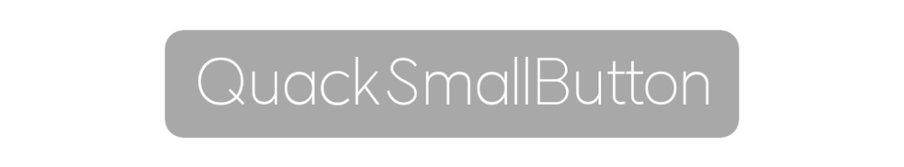</a>

- enabled: false
- fontscale: 2.0

- enabled: false
- fontscale: 1.0

- enabled: false
- fontscale: 1.5

- enabled: false
- fontscale: 0.5

### QuackSmallBorderToggleButton

<a href="team.duckie.quackquack.ui_QuackButton_QuackSmallBorderToggleButton[true,2]_[selected:true]-[fontscale:2.0].png">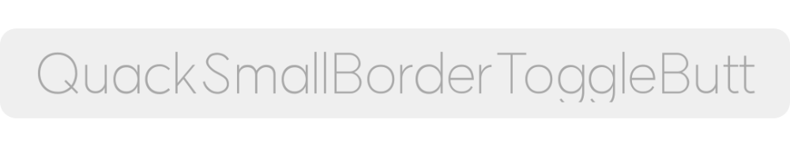</a>

- selected: true
- fontscale: 2.0

- selected: true
- fontscale: 1.0

<a href="team.duckie.quackquack.ui_QuackButton_QuackSmallBorderToggleButton[true,1.5]_[selected:true]-[fontscale:1.5].png">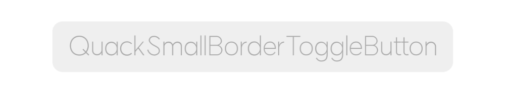</a>

- selected: true
- fontscale: 1.5

- selected: true
- fontscale: 0.5

<a href="team.duckie.quackquack.ui_QuackButton_QuackSmallBorderToggleButton[false,2]_[selected:false]-[fontscale:2.0].png">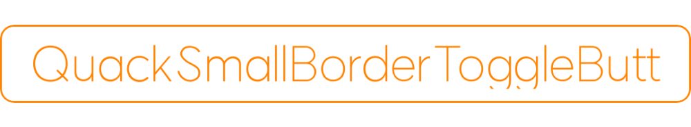</a>

- selected: false
- fontscale: 2.0

- selected: false
- fontscale: 1.0

<a href="team.duckie.quackquack.ui_QuackButton_QuackSmallBorderToggleButton[false,1.5]_[selected:false]-[fontscale:1.5].png">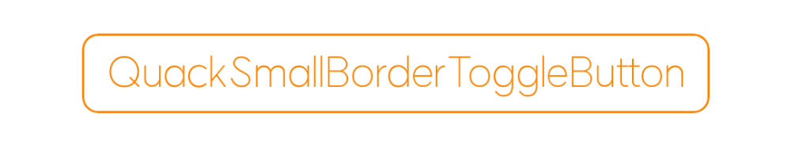</a>

- selected: false
- fontscale: 1.5

- selected: false
- fontscale: 0.5

### QuackMediumBorderToggleButton

<a href="team.duckie.quackquack.ui_QuackButton_QuackMediumBorderToggleButton[true,2]_[selected:true]-[fontscale:2.0].png">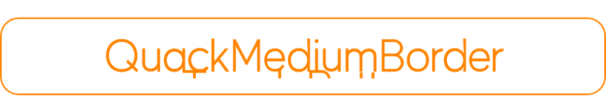</a>

- selected: true
- fontscale: 2.0

<a href="team.duckie.quackquack.ui_QuackButton_QuackMediumBorderToggleButton[true,1]_[selected:true]-[fontscale:1.0].png">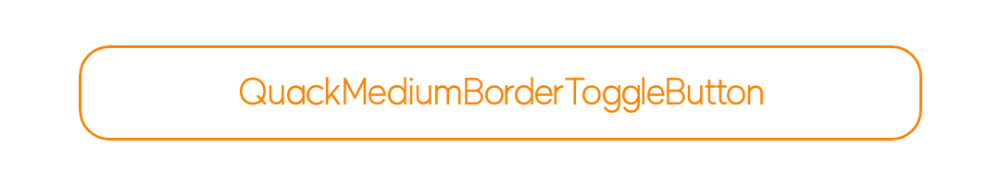</a>

- selected: true
- fontscale: 1.0

<a href="team.duckie.quackquack.ui_QuackButton_QuackMediumBorderToggleButton[true,1.5]_[selected:true]-[fontscale:1.5].png">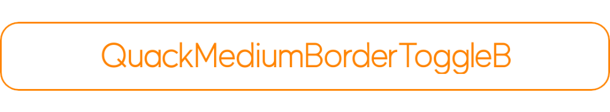</a>

- selected: true
- fontscale: 1.5

- selected: true
- fontscale: 0.5

<a href="team.duckie.quackquack.ui_QuackButton_QuackMediumBorderToggleButton[false,2]_[selected:false]-[fontscale:2.0].png">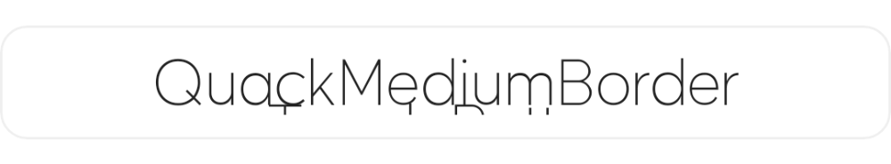</a>

- selected: false
- fontscale: 2.0

<a href="team.duckie.quackquack.ui_QuackButton_QuackMediumBorderToggleButton[false,1]_[selected:false]-[fontscale:1.0].png">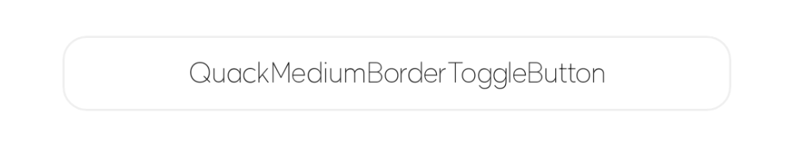</a>

- selected: false
- fontscale: 1.0

<a href="team.duckie.quackquack.ui_QuackButton_QuackMediumBorderToggleButton[false,1.5]_[selected:false]-[fontscale:1.5].png">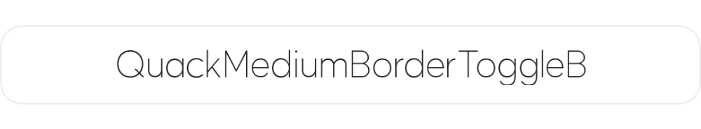</a>

- selected: false
- fontscale: 1.5

- selected: false
- fontscale: 0.5

### QuackLargeWhiteButton

<a href="team.duckie.quackquack.ui_QuackButton_QuackLargeWhiteButton[none,2]_[quackicon:none]-[fontscale:2.0].png">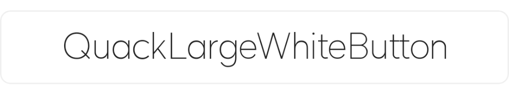</a>

- quackicon: none
- fontscale: 2.0

<a href="team.duckie.quackquack.ui_QuackButton_QuackLargeWhiteButton[none,1]_[quackicon:none]-[fontscale:1.0].png">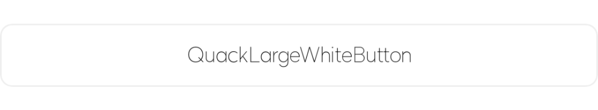</a>

- quackicon: none
- fontscale: 1.0

<a href="team.duckie.quackquack.ui_QuackButton_QuackLargeWhiteButton[none,1.5]_[quackicon:none]-[fontscale:1.5].png">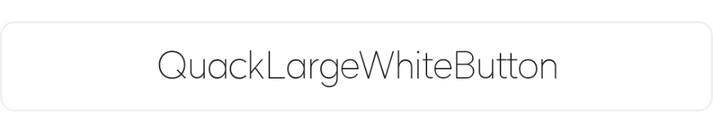</a>

- quackicon: none
- fontscale: 1.5

<a href="team.duckie.quackquack.ui_QuackButton_QuackLargeWhiteButton[none,0.5]_[quackicon:none]-[fontscale:0.5].png">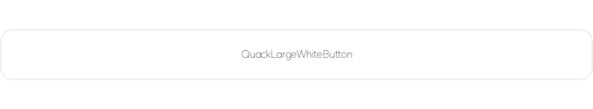</a>

- quackicon: none
- fontscale: 0.5

<a href="team.duckie.quackquack.ui_QuackButton_QuackLargeWhiteButton[close,2]_[quackicon:close]-[fontscale:2.0].png">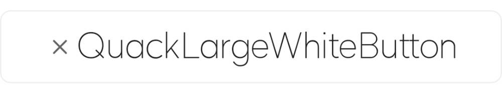</a>

- quackicon: close
- fontscale: 2.0

<a href="team.duckie.quackquack.ui_QuackButton_QuackLargeWhiteButton[close,1]_[quackicon:close]-[fontscale:1.0].png">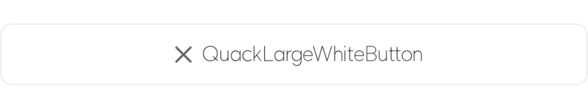</a>

- quackicon: close
- fontscale: 1.0

<a href="team.duckie.quackquack.ui_QuackButton_QuackLargeWhiteButton[close,1.5]_[quackicon:close]-[fontscale:1.5].png">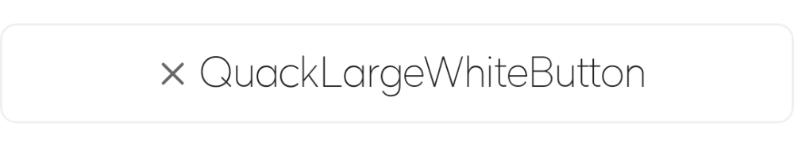</a>

- quackicon: close
- fontscale: 1.5

<a href="team.duckie.quackquack.ui_QuackButton_QuackLargeWhiteButton[close,0.5]_[quackicon:close]-[fontscale:0.5].png">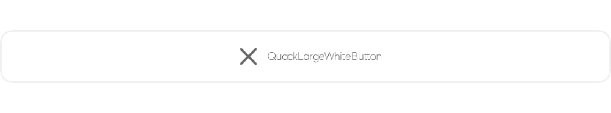</a>

- quackicon: close
- fontscale: 0.5

### QuackLargeButton

- active: true
- fontscale: 2.0

- active: true
- fontscale: 1.0

- active: true
- fontscale: 1.5

- active: true
- fontscale: 0.5

- active: false
- fontscale: 2.0

<a href="team.duckie.quackquack.ui_QuackButton_QuackLargeButton[false,1]_[active:false]-[fontscale:1.0].png">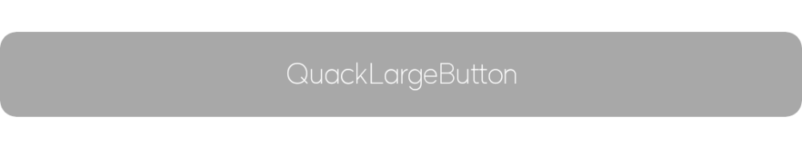</a>

- active: false
- fontscale: 1.0

- active: false
- fontscale: 1.5

- active: false
- fontscale: 0.5

### QuackLarge40WhiteButton

<a href="team.duckie.quackquack.ui_QuackButton_QuackLarge40WhiteButton[2]_[fontscale:2.0].png">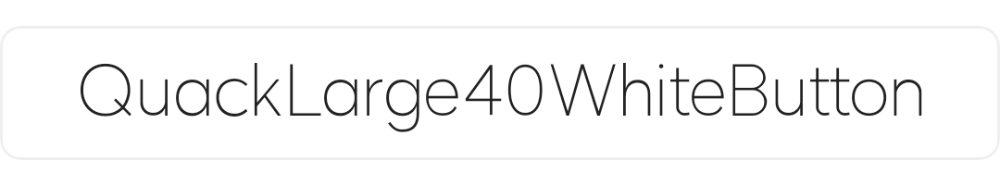</a>

- fontscale: 2.0

<a href="team.duckie.quackquack.ui_QuackButton_QuackLarge40WhiteButton[1]_[fontscale:1.0].png">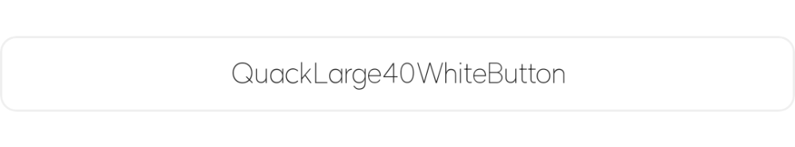</a>

- fontscale: 1.0

<a href="team.duckie.quackquack.ui_QuackButton_QuackLarge40WhiteButton[1.5]_[fontscale:1.5].png">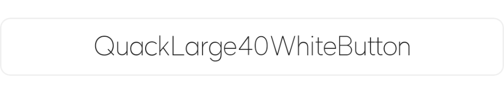</a>

- fontscale: 1.5

<a href="team.duckie.quackquack.ui_QuackButton_QuackLarge40WhiteButton[0.5]_[fontscale:0.5].png">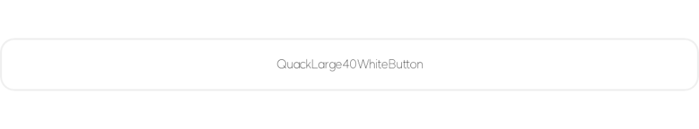</a>

- fontscale: 0.5

#### [🏠](README.md)