# QuackTab

### QuackMainTab

<a href="team.duckie.quackquack.ui_QuackTab_QuackMainTab[2,2]_[selectedtabindex:2]-[fontscale:2.0].png">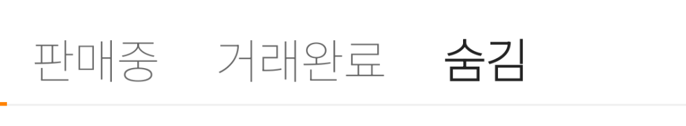</a>

- selectedtabindex: 2
- fontscale: 2.0

<a href="team.duckie.quackquack.ui_QuackTab_QuackMainTab[2,1]_[selectedtabindex:2]-[fontscale:1.0].png">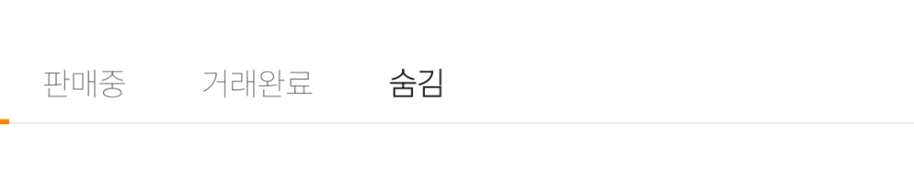</a>

- selectedtabindex: 2
- fontscale: 1.0

<a href="team.duckie.quackquack.ui_QuackTab_QuackMainTab[2,1.5]_[selectedtabindex:2]-[fontscale:1.5].png">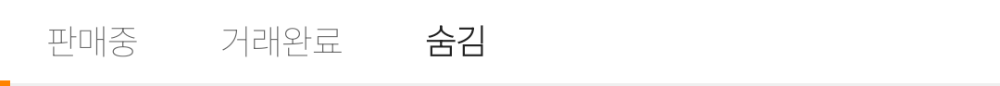</a>

- selectedtabindex: 2
- fontscale: 1.5

<a href="team.duckie.quackquack.ui_QuackTab_QuackMainTab[2,0.5]_[selectedtabindex:2]-[fontscale:0.5].png">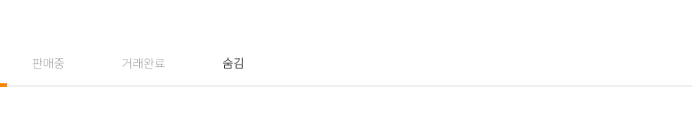</a>

- selectedtabindex: 2
- fontscale: 0.5

<a href="team.duckie.quackquack.ui_QuackTab_QuackMainTab[1,2]_[selectedtabindex:1]-[fontscale:2.0].png">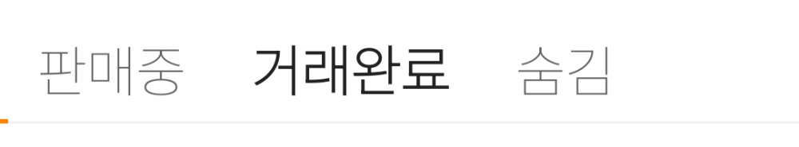</a>

- selectedtabindex: 1
- fontscale: 2.0

<a href="team.duckie.quackquack.ui_QuackTab_QuackMainTab[1,1]_[selectedtabindex:1]-[fontscale:1.0].png">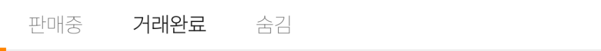</a>

- selectedtabindex: 1
- fontscale: 1.0

<a href="team.duckie.quackquack.ui_QuackTab_QuackMainTab[1,1.5]_[selectedtabindex:1]-[fontscale:1.5].png">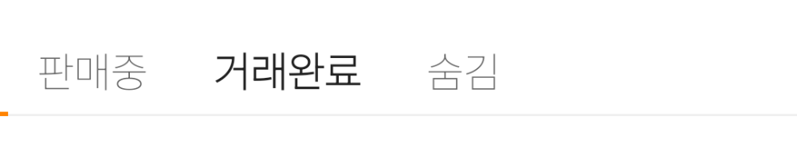</a>

- selectedtabindex: 1
- fontscale: 1.5

<a href="team.duckie.quackquack.ui_QuackTab_QuackMainTab[1,0.5]_[selectedtabindex:1]-[fontscale:0.5].png">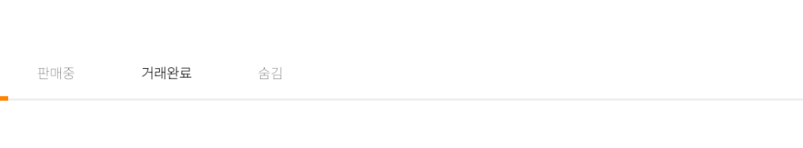</a>

- selectedtabindex: 1
- fontscale: 0.5

<a href="team.duckie.quackquack.ui_QuackTab_QuackMainTab[0,2]_[selectedtabindex:0]-[fontscale:2.0].png">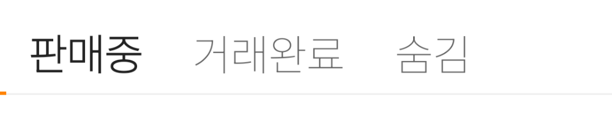</a>

- selectedtabindex: 0
- fontscale: 2.0

<a href="team.duckie.quackquack.ui_QuackTab_QuackMainTab[0,1]_[selectedtabindex:0]-[fontscale:1.0].png">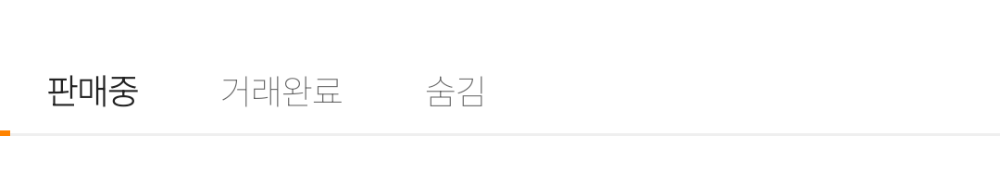</a>

- selectedtabindex: 0
- fontscale: 1.0

- selectedtabindex: 0
- fontscale: 1.5

<a href="team.duckie.quackquack.ui_QuackTab_QuackMainTab[0,0.5]_[selectedtabindex:0]-[fontscale:0.5].png">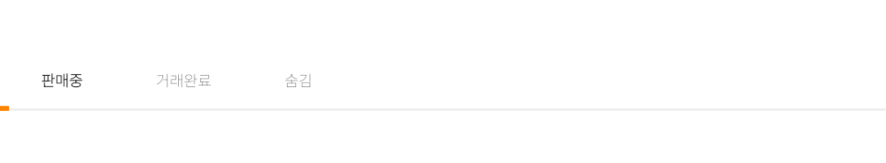</a>

- selectedtabindex: 0
- fontscale: 0.5

#### [🏠](README.md)