# QuackTextField

### QuackBasicTextField

<a href="team.duckie.quackquack.ui_QuackTextField_QuackBasicTextField[2,none,true,duckie]_[fontscale:2.0]-[decorationcontent:none]-[iserror:true]-[text:duckie].png">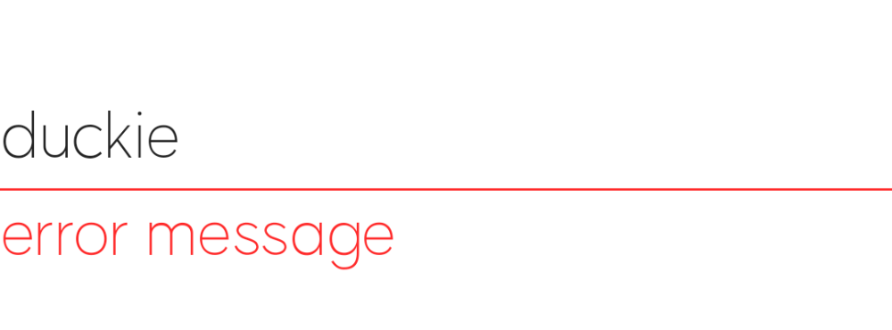</a>

- fontscale: 2.0
- decorationcontent: none
- iserror: true
- text: duckie

<a href="team.duckie.quackquack.ui_QuackTextField_QuackBasicTextField[2,none,true,]_[fontscale:2.0]-[decorationcontent:none]-[iserror:true]-[text:].png">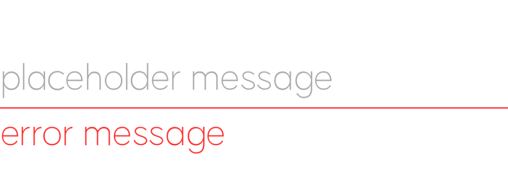</a>

- fontscale: 2.0
- decorationcontent: none
- iserror: true
- text: 

<a href="team.duckie.quackquack.ui_QuackTextField_QuackBasicTextField[2,none,false,duckie]_[fontscale:2.0]-[decorationcontent:none]-[iserror:false]-[text:duckie].png">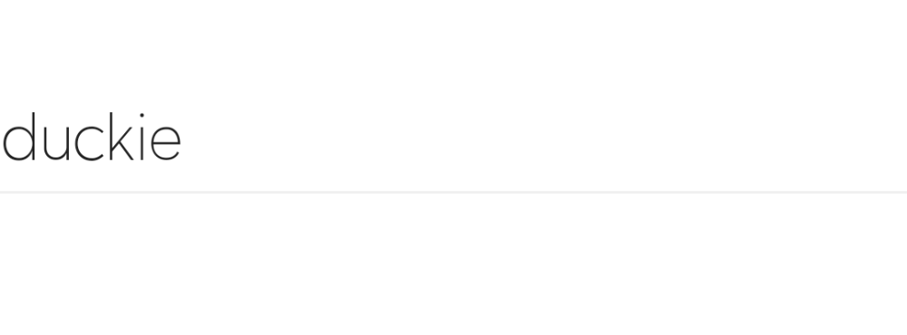</a>

- fontscale: 2.0
- decorationcontent: none
- iserror: false
- text: duckie

<a href="team.duckie.quackquack.ui_QuackTextField_QuackBasicTextField[2,none,false,]_[fontscale:2.0]-[decorationcontent:none]-[iserror:false]-[text:].png">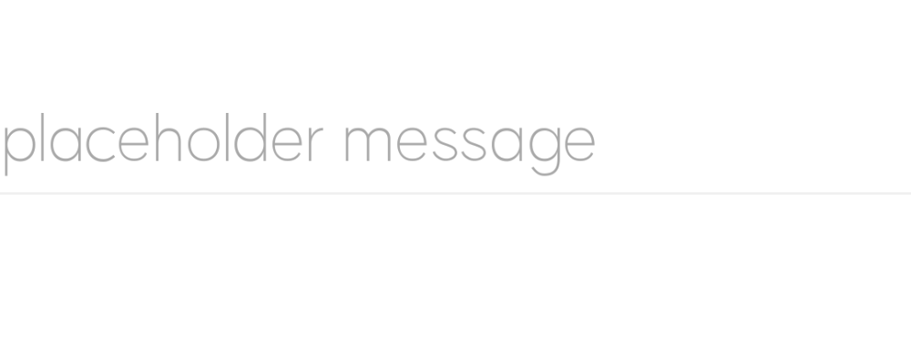</a>

- fontscale: 2.0
- decorationcontent: none
- iserror: false
- text: 

<a href="team.duckie.quackquack.ui_QuackTextField_QuackBasicTextField[2,long-text,true,duckie]_[fontscale:2.0]-[decorationcontent:long-text]-[iserror:true]-[text:duckie].png">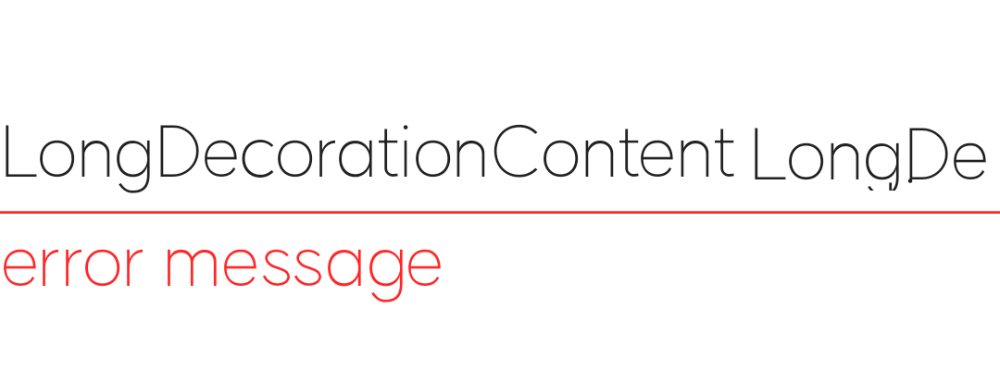</a>

- fontscale: 2.0
- decorationcontent: long
text
- iserror: true
- text: duckie

<a href="team.duckie.quackquack.ui_QuackTextField_QuackBasicTextField[2,long-text,true,]_[fontscale:2.0]-[decorationcontent:long-text]-[iserror:true]-[text:].png">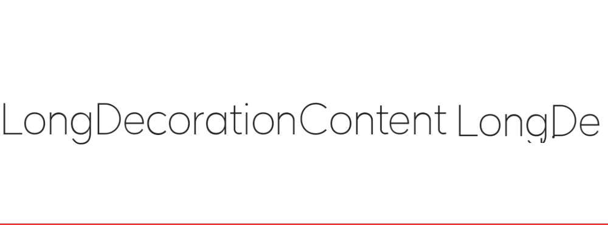</a>

- fontscale: 2.0
- decorationcontent: long
text
- iserror: true
- text: 

<a href="team.duckie.quackquack.ui_QuackTextField_QuackBasicTextField[2,long-text,false,duckie]_[fontscale:2.0]-[decorationcontent:long-text]-[iserror:false]-[text:duckie].png">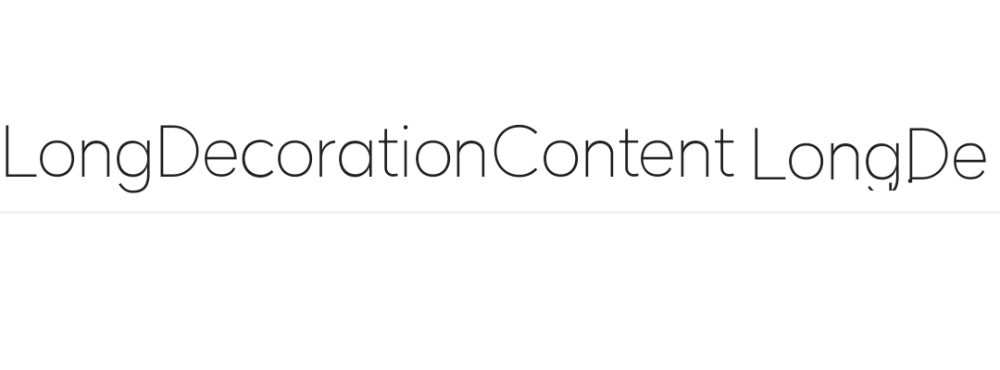</a>

- fontscale: 2.0
- decorationcontent: long
text
- iserror: false
- text: duckie

- fontscale: 2.0
- decorationcontent: long
text
- iserror: false
- text: 

<a href="team.duckie.quackquack.ui_QuackTextField_QuackBasicTextField[2,icon,true,duckie]_[fontscale:2.0]-[decorationcontent:icon]-[iserror:true]-[text:duckie].png">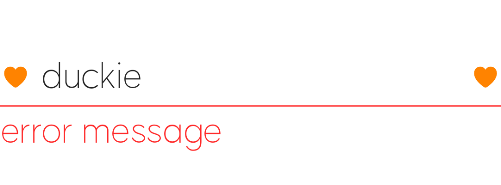</a>

- fontscale: 2.0
- decorationcontent: icon
- iserror: true
- text: duckie

<a href="team.duckie.quackquack.ui_QuackTextField_QuackBasicTextField[2,icon,true,]_[fontscale:2.0]-[decorationcontent:icon]-[iserror:true]-[text:].png">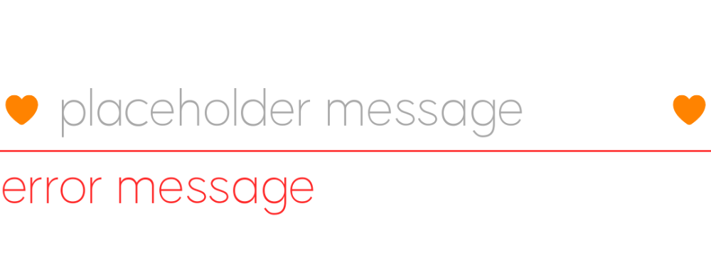</a>

- fontscale: 2.0
- decorationcontent: icon
- iserror: true
- text: 

<a href="team.duckie.quackquack.ui_QuackTextField_QuackBasicTextField[2,icon,false,duckie]_[fontscale:2.0]-[decorationcontent:icon]-[iserror:false]-[text:duckie].png">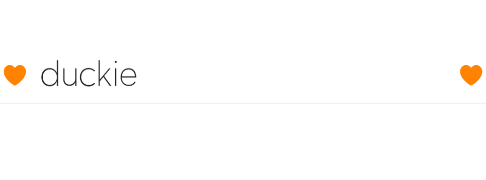</a>

- fontscale: 2.0
- decorationcontent: icon
- iserror: false
- text: duckie

<a href="team.duckie.quackquack.ui_QuackTextField_QuackBasicTextField[2,icon,false,]_[fontscale:2.0]-[decorationcontent:icon]-[iserror:false]-[text:].png">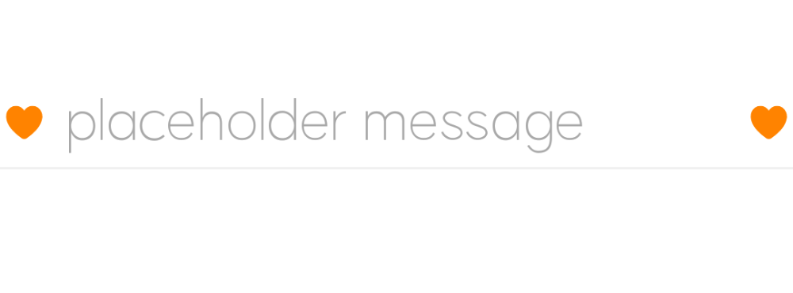</a>

- fontscale: 2.0
- decorationcontent: icon
- iserror: false
- text: 

<a href="team.duckie.quackquack.ui_QuackTextField_QuackBasicTextField[1.5,none,true,duckie]_[fontscale:1.5]-[decorationcontent:none]-[iserror:true]-[text:duckie].png">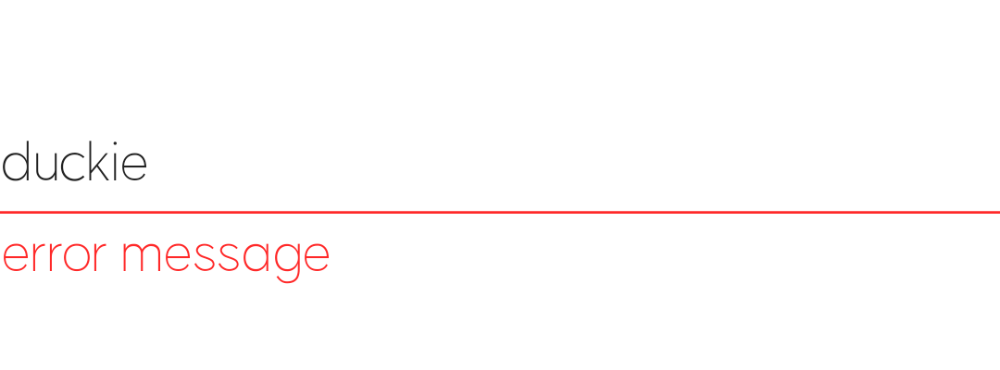</a>

- fontscale: 1.5
- decorationcontent: none
- iserror: true
- text: duckie

<a href="team.duckie.quackquack.ui_QuackTextField_QuackBasicTextField[1.5,none,true,]_[fontscale:1.5]-[decorationcontent:none]-[iserror:true]-[text:].png">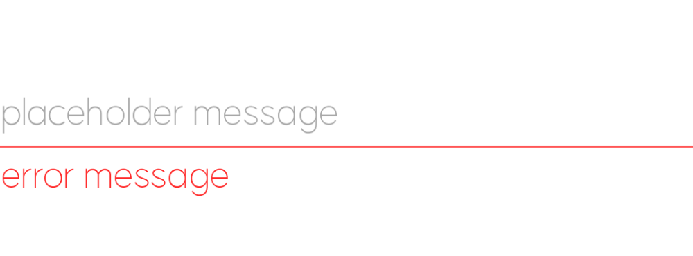</a>

- fontscale: 1.5
- decorationcontent: none
- iserror: true
- text: 

<a href="team.duckie.quackquack.ui_QuackTextField_QuackBasicTextField[1.5,none,false,duckie]_[fontscale:1.5]-[decorationcontent:none]-[iserror:false]-[text:duckie].png">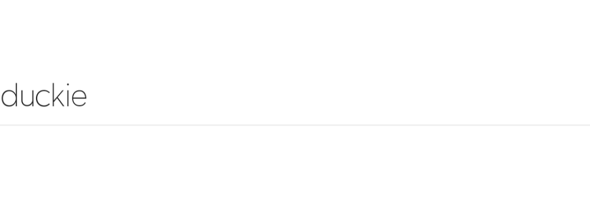</a>

- fontscale: 1.5
- decorationcontent: none
- iserror: false
- text: duckie

<a href="team.duckie.quackquack.ui_QuackTextField_QuackBasicTextField[1.5,none,false,]_[fontscale:1.5]-[decorationcontent:none]-[iserror:false]-[text:].png">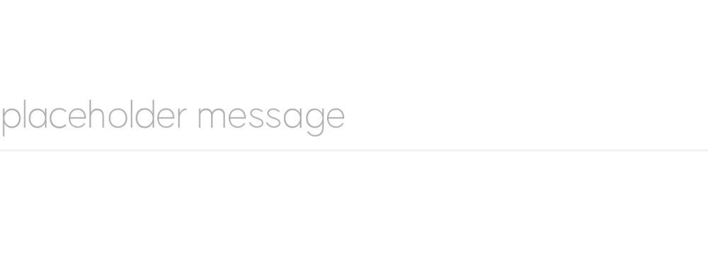</a>

- fontscale: 1.5
- decorationcontent: none
- iserror: false
- text: 

<a href="team.duckie.quackquack.ui_QuackTextField_QuackBasicTextField[1.5,long-text,true,duckie]_[fontscale:1.5]-[decorationcontent:long-text]-[iserror:true]-[text:duckie].png">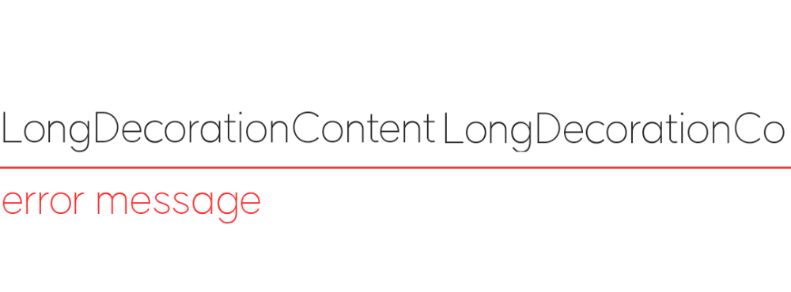</a>

- fontscale: 1.5
- decorationcontent: long
text
- iserror: true
- text: duckie

<a href="team.duckie.quackquack.ui_QuackTextField_QuackBasicTextField[1.5,long-text,true,]_[fontscale:1.5]-[decorationcontent:long-text]-[iserror:true]-[text:].png">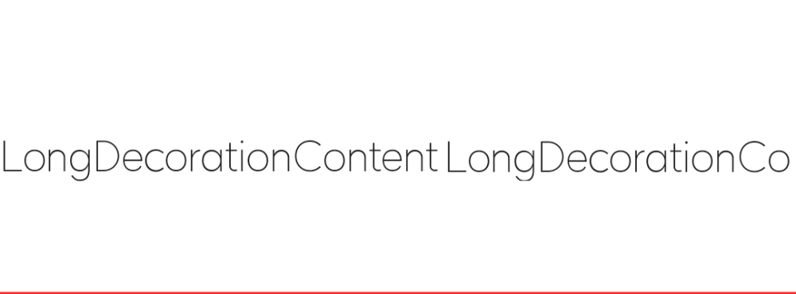</a>

- fontscale: 1.5
- decorationcontent: long
text
- iserror: true
- text: 

<a href="team.duckie.quackquack.ui_QuackTextField_QuackBasicTextField[1.5,long-text,false,duckie]_[fontscale:1.5]-[decorationcontent:long-text]-[iserror:false]-[text:duckie].png">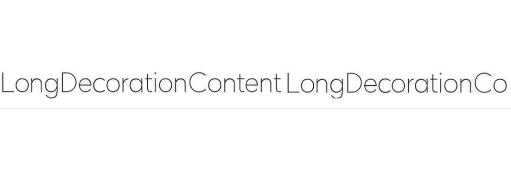</a>

- fontscale: 1.5
- decorationcontent: long
text
- iserror: false
- text: duckie

<a href="team.duckie.quackquack.ui_QuackTextField_QuackBasicTextField[1.5,long-text,false,]_[fontscale:1.5]-[decorationcontent:long-text]-[iserror:false]-[text:].png">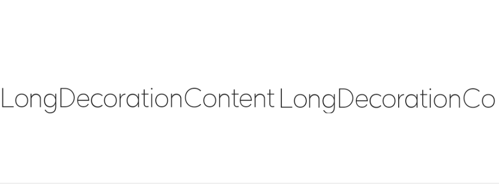</a>

- fontscale: 1.5
- decorationcontent: long
text
- iserror: false
- text: 

<a href="team.duckie.quackquack.ui_QuackTextField_QuackBasicTextField[1.5,icon,true,duckie]_[fontscale:1.5]-[decorationcontent:icon]-[iserror:true]-[text:duckie].png">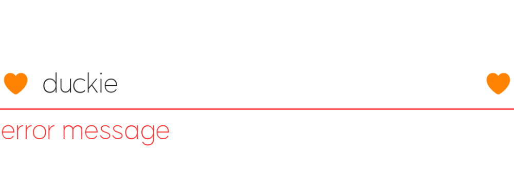</a>

- fontscale: 1.5
- decorationcontent: icon
- iserror: true
- text: duckie

<a href="team.duckie.quackquack.ui_QuackTextField_QuackBasicTextField[1.5,icon,true,]_[fontscale:1.5]-[decorationcontent:icon]-[iserror:true]-[text:].png">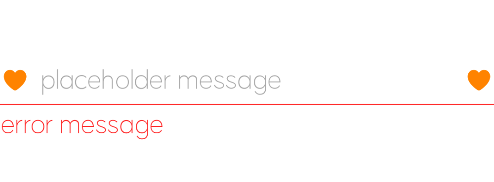</a>

- fontscale: 1.5
- decorationcontent: icon
- iserror: true
- text: 

<a href="team.duckie.quackquack.ui_QuackTextField_QuackBasicTextField[1.5,icon,false,duckie]_[fontscale:1.5]-[decorationcontent:icon]-[iserror:false]-[text:duckie].png">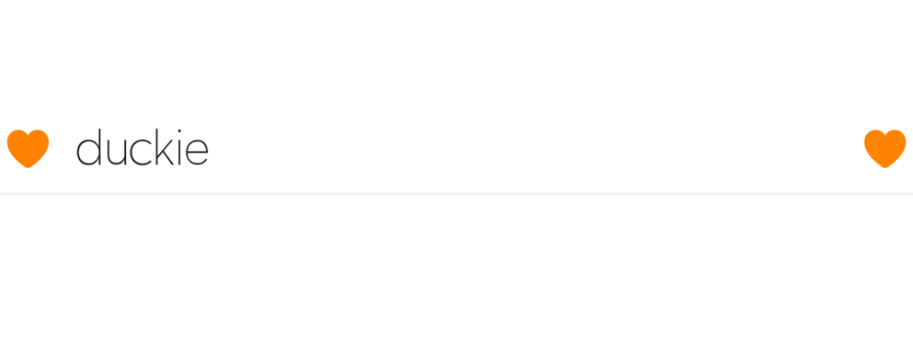</a>

- fontscale: 1.5
- decorationcontent: icon
- iserror: false
- text: duckie

<a href="team.duckie.quackquack.ui_QuackTextField_QuackBasicTextField[1.5,icon,false,]_[fontscale:1.5]-[decorationcontent:icon]-[iserror:false]-[text:].png">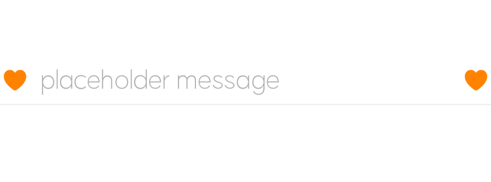</a>

- fontscale: 1.5
- decorationcontent: icon
- iserror: false
- text: 

<a href="team.duckie.quackquack.ui_QuackTextField_QuackBasicTextField[1,none,true,duckie]_[fontscale:1.0]-[decorationcontent:none]-[iserror:true]-[text:duckie].png">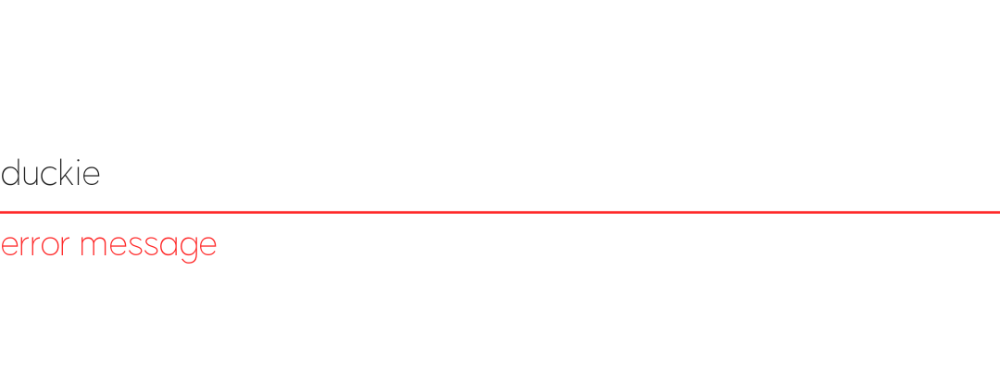</a>

- fontscale: 1.0
- decorationcontent: none
- iserror: true
- text: duckie

<a href="team.duckie.quackquack.ui_QuackTextField_QuackBasicTextField[1,none,true,]_[fontscale:1.0]-[decorationcontent:none]-[iserror:true]-[text:].png">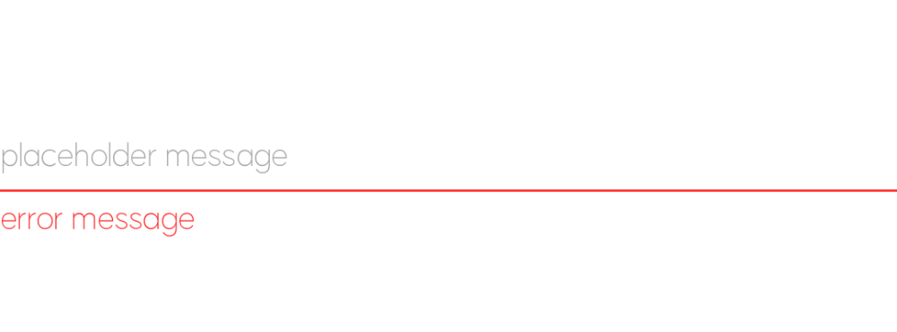</a>

- fontscale: 1.0
- decorationcontent: none
- iserror: true
- text: 

<a href="team.duckie.quackquack.ui_QuackTextField_QuackBasicTextField[1,none,false,duckie]_[fontscale:1.0]-[decorationcontent:none]-[iserror:false]-[text:duckie].png">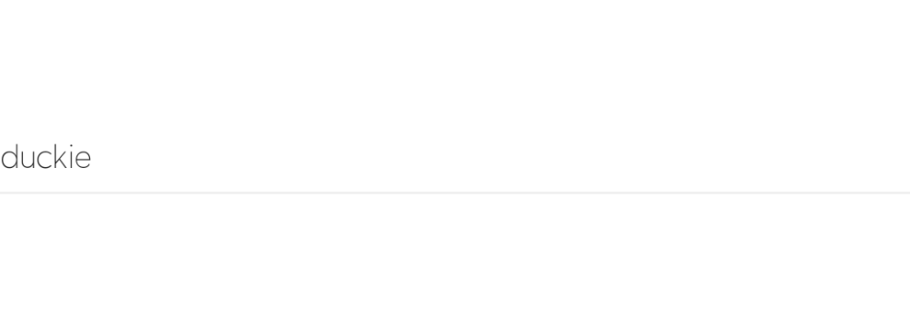</a>

- fontscale: 1.0
- decorationcontent: none
- iserror: false
- text: duckie

<a href="team.duckie.quackquack.ui_QuackTextField_QuackBasicTextField[1,none,false,]_[fontscale:1.0]-[decorationcontent:none]-[iserror:false]-[text:].png">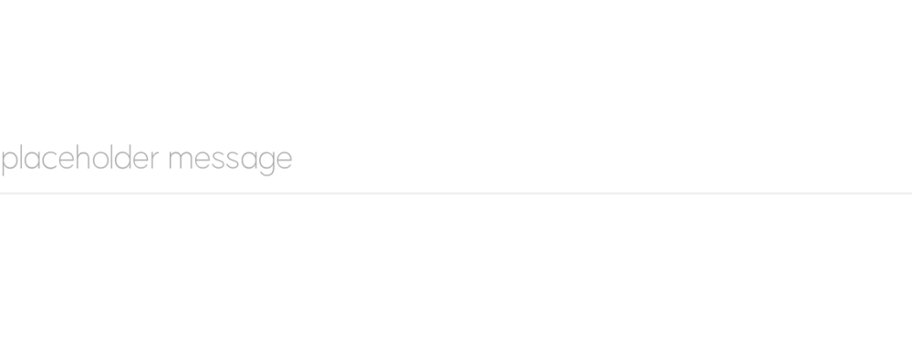</a>

- fontscale: 1.0
- decorationcontent: none
- iserror: false
- text: 

<a href="team.duckie.quackquack.ui_QuackTextField_QuackBasicTextField[1,long-text,true,duckie]_[fontscale:1.0]-[decorationcontent:long-text]-[iserror:true]-[text:duckie].png">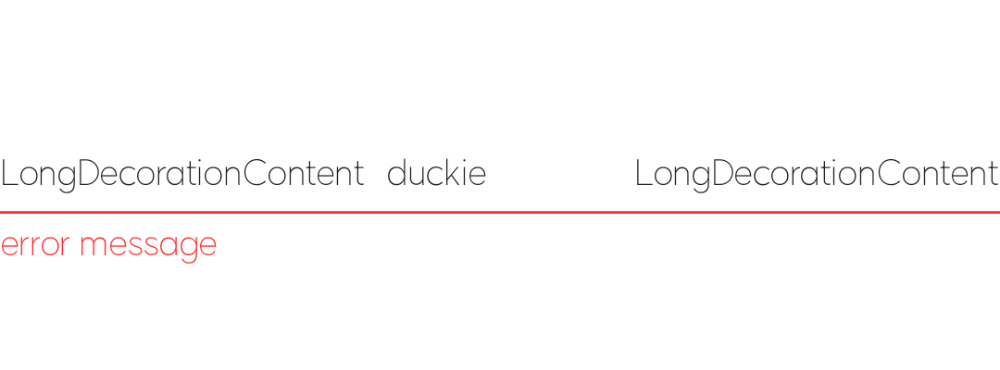</a>

- fontscale: 1.0
- decorationcontent: long
text
- iserror: true
- text: duckie

<a href="team.duckie.quackquack.ui_QuackTextField_QuackBasicTextField[1,long-text,true,]_[fontscale:1.0]-[decorationcontent:long-text]-[iserror:true]-[text:].png">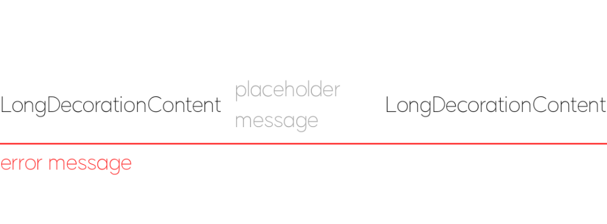</a>

- fontscale: 1.0
- decorationcontent: long
text
- iserror: true
- text: 

<a href="team.duckie.quackquack.ui_QuackTextField_QuackBasicTextField[1,long-text,false,duckie]_[fontscale:1.0]-[decorationcontent:long-text]-[iserror:false]-[text:duckie].png">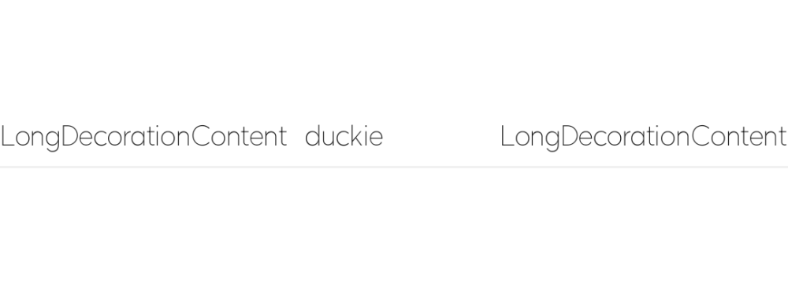</a>

- fontscale: 1.0
- decorationcontent: long
text
- iserror: false
- text: duckie

<a href="team.duckie.quackquack.ui_QuackTextField_QuackBasicTextField[1,long-text,false,]_[fontscale:1.0]-[decorationcontent:long-text]-[iserror:false]-[text:].png">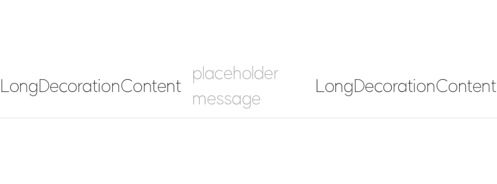</a>

- fontscale: 1.0
- decorationcontent: long
text
- iserror: false
- text: 

<a href="team.duckie.quackquack.ui_QuackTextField_QuackBasicTextField[1,icon,true,duckie]_[fontscale:1.0]-[decorationcontent:icon]-[iserror:true]-[text:duckie].png">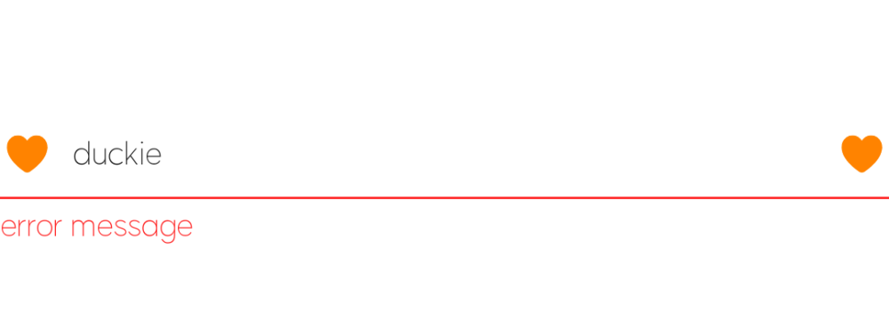</a>

- fontscale: 1.0
- decorationcontent: icon
- iserror: true
- text: duckie

<a href="team.duckie.quackquack.ui_QuackTextField_QuackBasicTextField[1,icon,true,]_[fontscale:1.0]-[decorationcontent:icon]-[iserror:true]-[text:].png">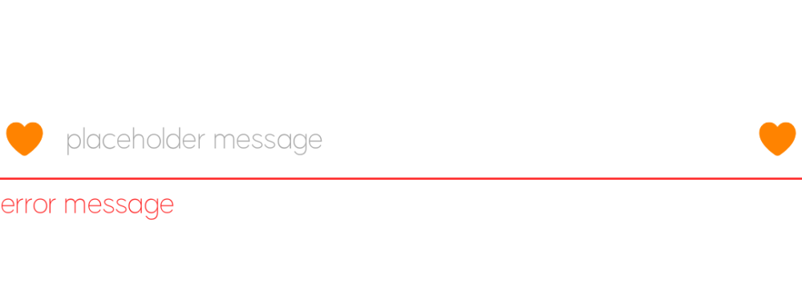</a>

- fontscale: 1.0
- decorationcontent: icon
- iserror: true
- text: 

<a href="team.duckie.quackquack.ui_QuackTextField_QuackBasicTextField[1,icon,false,duckie]_[fontscale:1.0]-[decorationcontent:icon]-[iserror:false]-[text:duckie].png">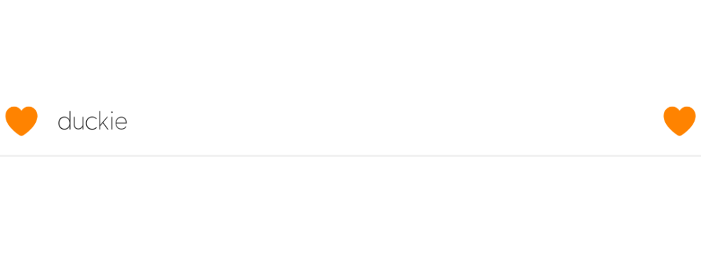</a>

- fontscale: 1.0
- decorationcontent: icon
- iserror: false
- text: duckie

- fontscale: 1.0
- decorationcontent: icon
- iserror: false
- text: 

<a href="team.duckie.quackquack.ui_QuackTextField_QuackBasicTextField[0.5,none,true,duckie]_[fontscale:0.5]-[decorationcontent:none]-[iserror:true]-[text:duckie].png">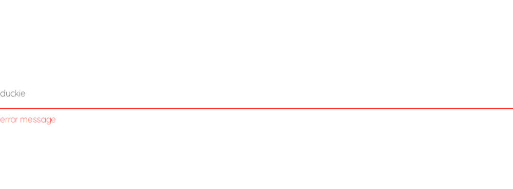</a>

- fontscale: 0.5
- decorationcontent: none
- iserror: true
- text: duckie

<a href="team.duckie.quackquack.ui_QuackTextField_QuackBasicTextField[0.5,none,true,]_[fontscale:0.5]-[decorationcontent:none]-[iserror:true]-[text:].png">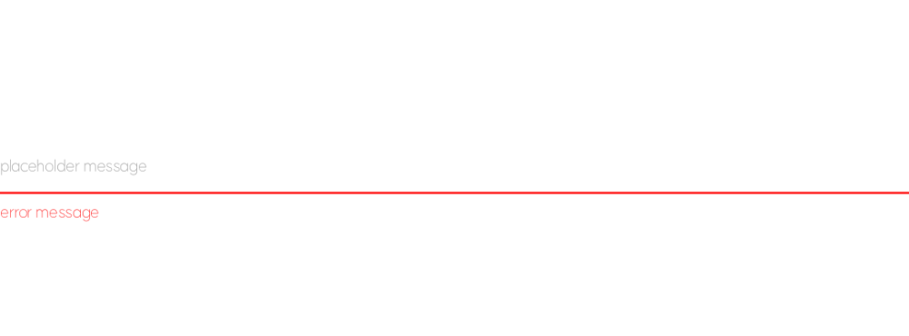</a>

- fontscale: 0.5
- decorationcontent: none
- iserror: true
- text: 

<a href="team.duckie.quackquack.ui_QuackTextField_QuackBasicTextField[0.5,none,false,duckie]_[fontscale:0.5]-[decorationcontent:none]-[iserror:false]-[text:duckie].png">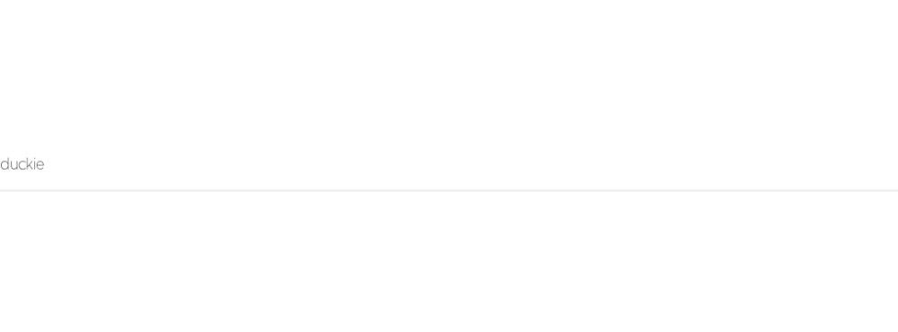</a>

- fontscale: 0.5
- decorationcontent: none
- iserror: false
- text: duckie

<a href="team.duckie.quackquack.ui_QuackTextField_QuackBasicTextField[0.5,none,false,]_[fontscale:0.5]-[decorationcontent:none]-[iserror:false]-[text:].png">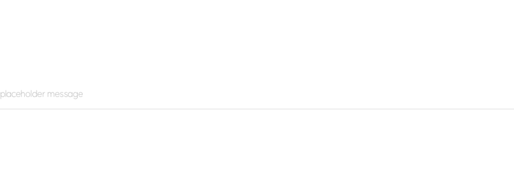</a>

- fontscale: 0.5
- decorationcontent: none
- iserror: false
- text: 

<a href="team.duckie.quackquack.ui_QuackTextField_QuackBasicTextField[0.5,long-text,true,duckie]_[fontscale:0.5]-[decorationcontent:long-text]-[iserror:true]-[text:duckie].png">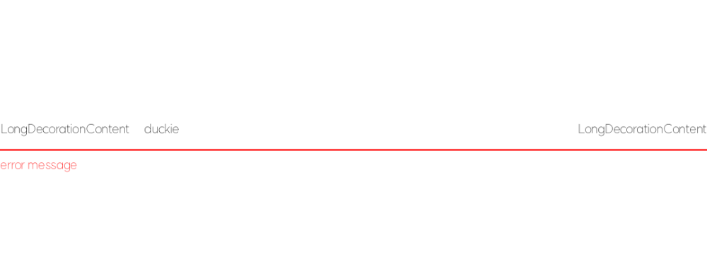</a>

- fontscale: 0.5
- decorationcontent: long
text
- iserror: true
- text: duckie

<a href="team.duckie.quackquack.ui_QuackTextField_QuackBasicTextField[0.5,long-text,true,]_[fontscale:0.5]-[decorationcontent:long-text]-[iserror:true]-[text:].png">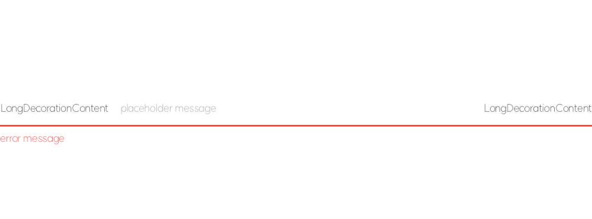</a>

- fontscale: 0.5
- decorationcontent: long
text
- iserror: true
- text: 

<a href="team.duckie.quackquack.ui_QuackTextField_QuackBasicTextField[0.5,long-text,false,duckie]_[fontscale:0.5]-[decorationcontent:long-text]-[iserror:false]-[text:duckie].png">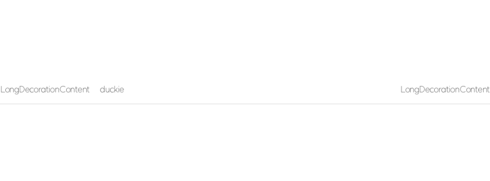</a>

- fontscale: 0.5
- decorationcontent: long
text
- iserror: false
- text: duckie

<a href="team.duckie.quackquack.ui_QuackTextField_QuackBasicTextField[0.5,long-text,false,]_[fontscale:0.5]-[decorationcontent:long-text]-[iserror:false]-[text:].png">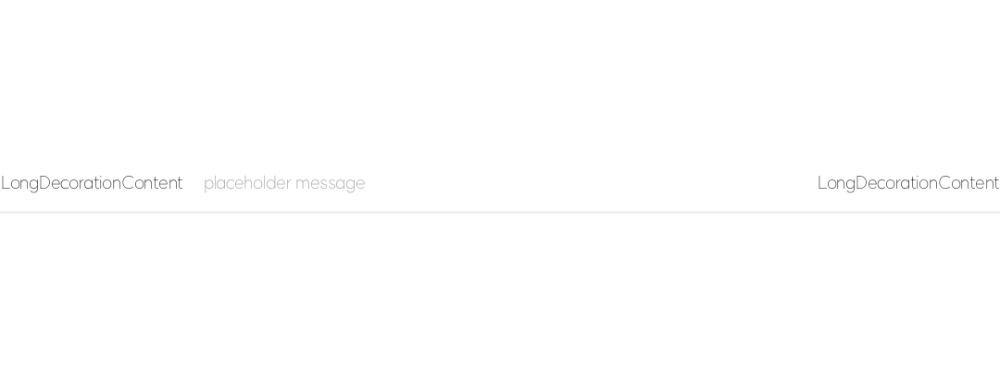</a>

- fontscale: 0.5
- decorationcontent: long
text
- iserror: false
- text: 

- fontscale: 0.5
- decorationcontent: icon
- iserror: true
- text: duckie

<a href="team.duckie.quackquack.ui_QuackTextField_QuackBasicTextField[0.5,icon,true,]_[fontscale:0.5]-[decorationcontent:icon]-[iserror:true]-[text:].png">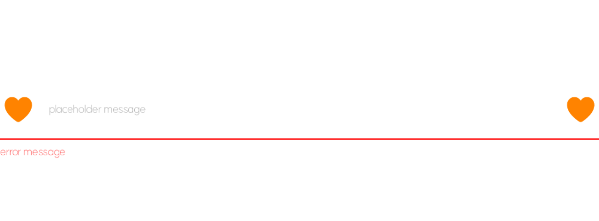</a>

- fontscale: 0.5
- decorationcontent: icon
- iserror: true
- text: 

<a href="team.duckie.quackquack.ui_QuackTextField_QuackBasicTextField[0.5,icon,false,duckie]_[fontscale:0.5]-[decorationcontent:icon]-[iserror:false]-[text:duckie].png">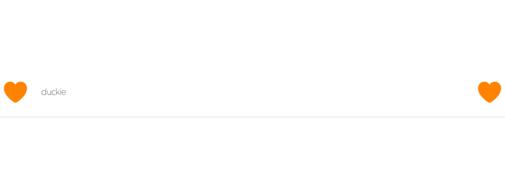</a>

- fontscale: 0.5
- decorationcontent: icon
- iserror: false
- text: duckie

<a href="team.duckie.quackquack.ui_QuackTextField_QuackBasicTextField[0.5,icon,false,]_[fontscale:0.5]-[decorationcontent:icon]-[iserror:false]-[text:].png">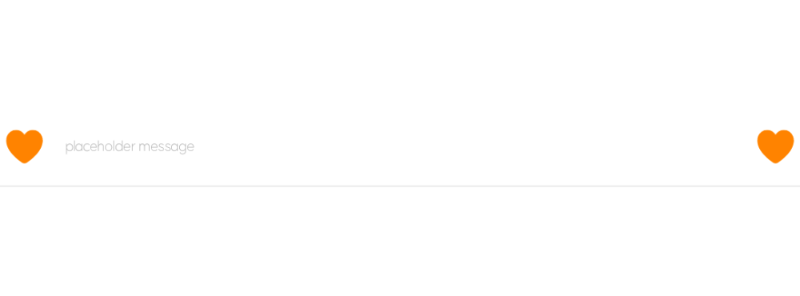</a>

- fontscale: 0.5
- decorationcontent: icon
- iserror: false
- text: 

#### [🏠](README.md)