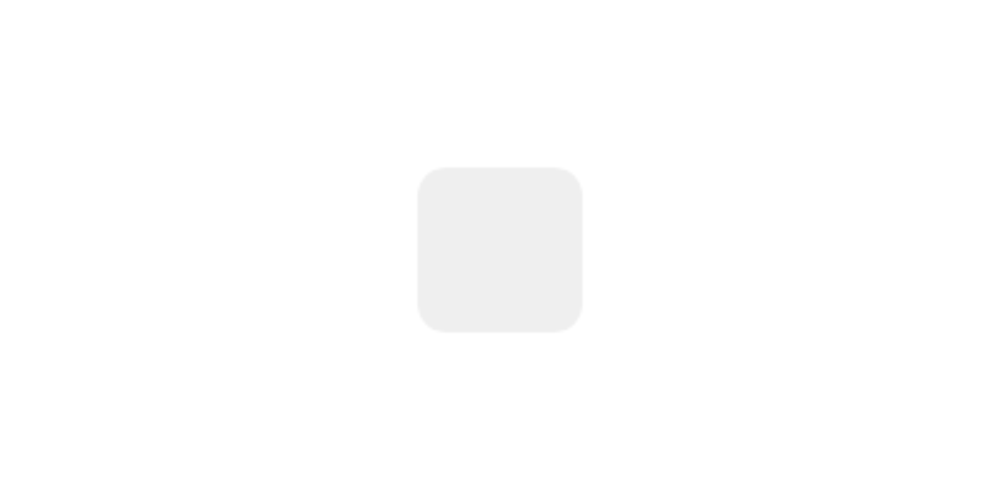
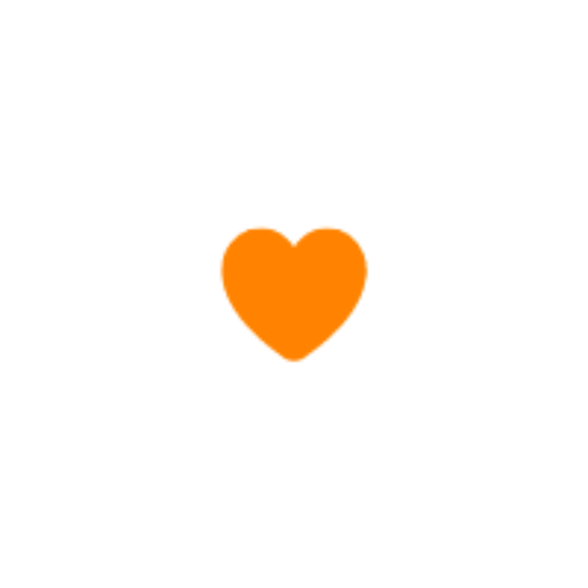
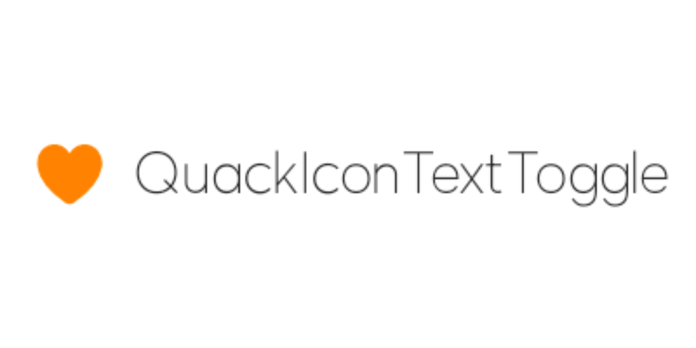
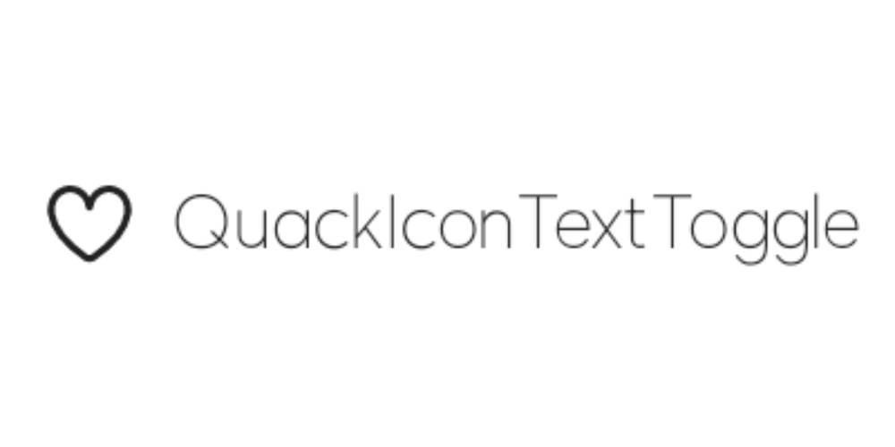
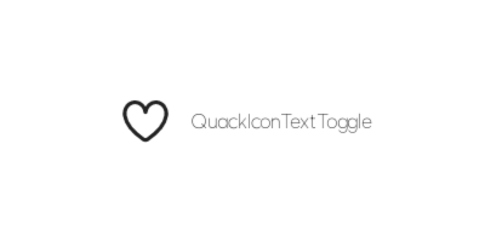

# QuackToggle

### QuackSquareCheckBox

- checked: true

- checked: false

### QuackRoundCheckBox

- checked: true

- checked: false

### QuackIconToggle

- checked: true

- checked: false

### QuackIconTextToggle

- checked: true
- fontscale: 2.0

- checked: true
- fontscale: 1.0

- checked: true
- fontscale: 1.5

- checked: true
- fontscale: 0.5

- checked: false
- fontscale: 2.0

- checked: false
- fontscale: 1.0

- checked: false
- fontscale: 1.5

- checked: false
- fontscale: 0.5

#### [🏠](README.md)